# 🏥 MedCare HMS — AI-Powered Hospital & Healthcare Management System

> An enterprise-grade healthcare management solution equipped with role-based dashboards, real-time IoT vital telemetry, AI diagnostics, and a secure blockchain-inspired audit log.

---

## 1. Introduction
**MedCare HMS** is designed to digitize, automate, and secure hospital workflows. The system replaces manual medical records, long queues, and uncoordinated department communications with a centralized control center. By integrating generative AI, speech recognition, and visual diagnostic tools, MedCare HMS simplifies clinical dictation for doctors, automates scan reviews for pathologists, provides live telemetry alerts for ward nurses, and gives patients an interactive self-service health portal.

---

## 2. Project Scope
The system handles three major pillars of healthcare operations:
* **Administrative Scope**: Front-desk scheduling, receptionist walk-ins, billing/invoice generation, insurance claims, and emergency triage priority queues.
* **Clinical Scope**: Doctor consultation notes, digitized prescriptions, lab test kanban workflows, smart pharmacy inventory management, and bedside patient vital monitoring.
* **Intelligent Scope (AI)**: Multilingual symptom voice assistant, computer vision anomalies indicator, ICD-10 medical billing code dictation scribes, wait-time prediction analytics, and indoor clinic navigation.

---

## 3. System Architecture Diagram

```mermaid
graph TD
    %% Roles Layer
    subgraph Users ["👥 User Roles"]
        Admin[Hospital Admin]
        Dr[Doctor]
        Nurse[Nurse]
        Patient[Patient / User]
        Staff[Receptionist / Billing / Pharmacist / Lab]
    end

    %% Frontend Layer
    subgraph Frontend ["🎨 Frontend (React 19 + Custom CSS)"]
        UI[Sidebar & Layout Header]
        Widget[Voice AI Widget - Web Speech API]
        Charts[Analytics Charts - Chart.js]
        Command[AI Command Center]
        Anatomy[Interactive Body Map]
        SigPad[Digital Signature Canvas]
        Router[React Router 7 - RBAC Routing]
        AuthCtx[Auth Context - Local Session Cache]
    end

    %% Router Links
    Admin --> UI
    Dr --> Command
    Nurse --> UI
    Patient --> Anatomy
    Staff --> UI

    %% Backend Service Layer
    subgraph Backend ["⚡ Backend API (Express.js Server)"]
        AuthM[Auth Middleware & JWT Sign]
        RBAC[Role Guard Middleware]
        Audit[Audit Logger Middleware]
        AISvc[AI Services - Local NLP Generative Engine]
        Routes[14 REST Route Controllers]
    end

    %% Connections
    Router -->|JSON Requests| AuthM
    Widget -->|Speech Query| AISvc
    SigPad -->|Print PDF| UI

    %% Database Layer
    subgraph Database ["💾 Database (MongoDB + Mongoose Models)"]
        UModel[User Schema]
        PModel[Patient Schema]
        DModel[Doctor Schema]
        AModel[Appointment Schema]
        LModel[LabTest Schema]
        IModel[Invoice Schema]
        MedModel[Medicine Schema]
        LogModel[AuditLog Schema]
    end

    Routes --> UModel
    Routes --> PModel
    Routes --> DModel
    Routes --> AModel
    Routes --> LModel
    Routes --> IModel
    Routes --> MedModel
    Routes --> LogModel
```

---

## 4. Key Stakeholders
* **Hospital Admin & Board**: Monitors operational dashboards, monthly revenue charts, ward occupancy, and department logs.
* **Pathologists & Radiologists**: Analyzes medical scans and signs laboratory reports digitally to issue verified PDFs.
* **On-Call Doctors & Surgeons**: Coordinates patient lists, writes digital prescriptions, checks AI diagnostic scans, and dictate consultation notes.
* **Ward Nurses**: Reviews bedside monitors, records vital streams, and manages daily tasks.
* **Pharmacists & Lab Technicians**: Tracks pharmacy stock levels and handles laboratory Kanban queues.
* **Patients (Customers)**: Schedules appointments, views lab reports, checks symptoms, and tracks medication schedules.

---

## 5. File Details & Directory Map

### 📁 Frontend codebase (`/src`)
| File Path | Description |
|-----------|-------------|
| [main.jsx](file:///c:/Users/hp/Desktop/project/hospital-management-system/src/main.jsx) | React application entry point. |
| [App.jsx](file:///c:/Users/hp/Desktop/project/hospital-management-system/src/App.jsx) | Declares client routes and maps directories to the layout sidebar. |
| [index.css](file:///c:/Users/hp/Desktop/project/hospital-management-system/src/index.css) | Global design system. Curates the light pastel green/blue color variables and animations. |
| `/context` | |
| [AuthContext.jsx](file:///c:/Users/hp/Desktop/project/hospital-management-system/src/context/AuthContext.jsx) | Manages JWT user sessions. Defaults automatically to **Hospital Admin** for presentation convenience. |
| `/components/AI` | |
| [AIChatWidget.jsx](file:///c:/Users/hp/Desktop/project/hospital-management-system/src/components/AI/AIChatWidget.jsx) | Floating AI chatbot. Connects voice dictation (Speech-to-Text), volume control, and multilingual translation. |
| `/components/Layout` | |
| [Sidebar.jsx](file:///c:/Users/hp/Desktop/project/hospital-management-system/src/components/Layout/Sidebar.jsx) | Sidebar navigation component displaying links dynamically based on user role permissions. |
| [DashboardLayout.jsx](file:///c:/Users/hp/Desktop/project/hospital-management-system/src/components/Layout/DashboardLayout.jsx) | Core layout wrapper setting up head headers, routing map titles, and embedding the AI chat. |
| `/pages/AI` | |
| [AICommandCenter.jsx](file:///c:/Users/hp/Desktop/project/hospital-management-system/src/pages/AI/AICommandCenter.jsx) | Advanced AI hub. Contains the Canvas ECG waveform drawer, medical scanner, scribe dictation, human body map, and signature canvas report generator. |
| `/pages/Dashboard` | |
| [AdminDashboard.jsx](file:///c:/Users/hp/Desktop/project/hospital-management-system/src/pages/Dashboard/AdminDashboard.jsx) | Admin dashboard. Houses metrics, quick action triggers, and operational charts. |
| [PatientDashboard.jsx](file:///c:/Users/hp/Desktop/project/hospital-management-system/src/pages/Dashboard/PatientDashboard.jsx) | Patient portal containing the anatomy locator body map, smart medication checklists, and wait-time circular gauge. |
| `/pages/Emergency` | |
| [EmergencyDashboard.jsx](file:///c:/Users/hp/Desktop/project/hospital-management-system/src/pages/Emergency/EmergencyDashboard.jsx) | ER command board. Hosts the GPS ambulance radar countdown tracking and the Trauma Bay grid scheduler. |

### 📁 Backend codebase (`/server`)
| File Path | Description |
|-----------|-------------|
| [server.js](file:///c:/Users/hp/Desktop/project/hospital-management-system/server/server.js) | Server entry point. Mounts all middleware and links the 14 REST endpoints. |
| `/middleware` | |
| [auth.js](file:///c:/Users/hp/Desktop/project/hospital-management-system/server/middleware/auth.js) | JWT verification middleware generating key tokens. |
| [roleGuard.js](file:///c:/Users/hp/Desktop/project/hospital-management-system/server/middleware/roleGuard.js) | Enforces role permissions across database collections. |
| [auditLogger.js](file:///c:/Users/hp/Desktop/project/hospital-management-system/server/middleware/auditLogger.js) | Writes activity logging records to the MongoDB database automatically. |
| `/models` | |
| [User.js](file:///c:/Users/hp/Desktop/project/hospital-management-system/server/models/User.js) | Mongoose schema representing hospital system accounts (bcrypt hashed). |
| [Patient.js](file:///c:/Users/hp/Desktop/project/hospital-management-system/server/models/Patient.js) | Stores patient profile details, allergies, and insurance info. |
| [Doctor.js](file:///c:/Users/hp/Desktop/project/hospital-management-system/server/models/Doctor.js) | Contains specialist availability times, تجرب and fees. |
| [Appointment.js](file:///c:/Users/hp/Desktop/project/hospital-management-system/server/models/Appointment.js) | Manages calendar booking states (Requested ➔ Confirmed ➔ Consultation ➔ Completed). |
| [AuditLog.js](file:///c:/Users/hp/Desktop/project/hospital-management-system/server/models/AuditLog.js) | Database ledger for security audit logs. |
| `/routes` | |
| [ai.js](file:///c:/Users/hp/Desktop/project/hospital-management-system/server/routes/ai.js) | Routes queries to the generative clinical service endpoints. |
| [patients.js](file:///c:/Users/hp/Desktop/project/hospital-management-system/server/routes/patients.js) | Handles CRUD operations for the patient register database. |
