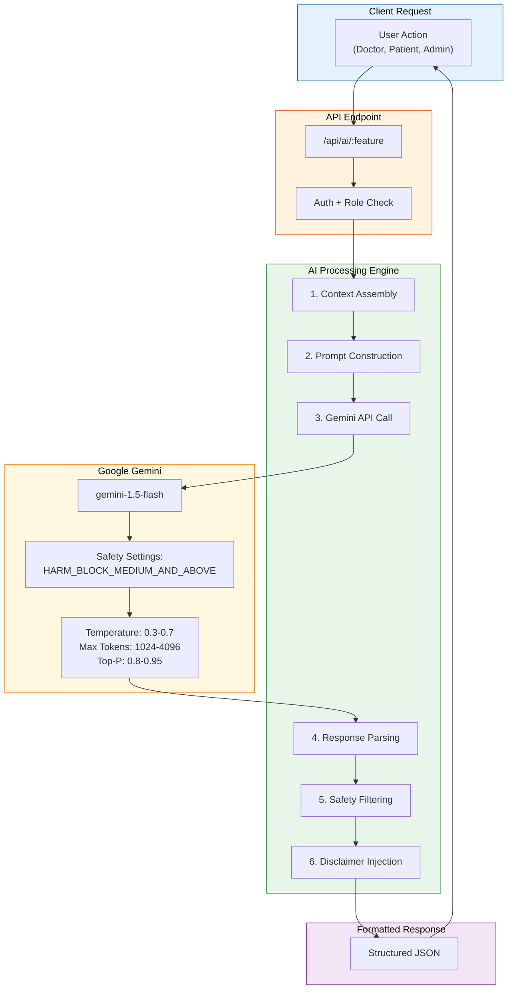
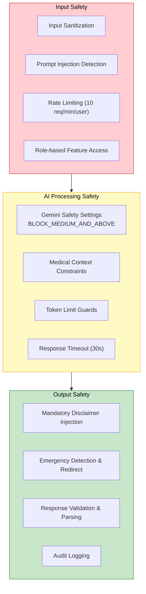

# 🤖 AI Agent Design Document

**Project:** MedCare HMS — AI-Powered Hospital Management System
**AI Provider:** Google Gemini (via `@google/generative-ai` SDK)
**Models Used:** `gemini-1.5-flash` (default), `gemini-1.5-pro` (complex analysis)
**Version:** 1.0.0
**Last Updated:** 2026-06-24

---

## Table of Contents

- [Overview](#overview)
- [AI Architecture Overview](#ai-architecture-overview)
- [AI Features](#ai-features)
  - [1. Symptom Analyzer](#1-symptom-analyzer)
  - [2. Medical Record Summarizer](#2-medical-record-summarizer)
  - [3. Prescription Explanation Bot](#3-prescription-explanation-bot)
  - [4. Appointment Assistant](#4-appointment-assistant)
  - [5. Operations Dashboard AI](#5-operations-dashboard-ai)
- [Ethical Considerations](#ethical-considerations)
- [Safety Architecture](#safety-architecture)
- [Future Improvements](#future-improvements)

---

## Overview

MedCare HMS integrates an **AI Healthcare Assistant** powered by Google's Gemini large language model. The AI layer provides **five distinct features** designed to augment — never replace — clinical decision-making by healthcare professionals.

**Core Principles:**

| Principle | Implementation |
|-----------|---------------|
| **Augmentation, not Replacement** | AI provides suggestions and summaries; final decisions are always made by qualified healthcare professionals |
| **Transparency** | Every AI response includes disclaimers about its advisory nature |
| **Context-Aware** | AI features receive relevant patient/operational data as context for accurate responses |
| **Safety-First** | Harmful content filters, medical safety settings, and hallucination guards are built in |
| **Privacy-Conscious** | Patient data sent to AI is minimized; PII is scrubbed where possible |

---

## AI Architecture Overview



**Shared Configuration:**

```javascript
const { GoogleGenerativeAI } = require('@google/generative-ai');

const genAI = new GoogleGenerativeAI(process.env.GOOGLE_AI_API_KEY);

// Default model configuration
const defaultConfig = {
  model: 'gemini-1.5-flash',
  generationConfig: {
    temperature: 0.4,
    topP: 0.9,
    topK: 40,
    maxOutputTokens: 2048,
  },
  safetySettings: [
    {
      category: 'HARM_CATEGORY_DANGEROUS_CONTENT',
      threshold: 'BLOCK_MEDIUM_AND_ABOVE',
    },
    {
      category: 'HARM_CATEGORY_HARASSMENT',
      threshold: 'BLOCK_MEDIUM_AND_ABOVE',
    },
    {
      category: 'HARM_CATEGORY_HATE_SPEECH',
      threshold: 'BLOCK_MEDIUM_AND_ABOVE',
    },
    {
      category: 'HARM_CATEGORY_SEXUALLY_EXPLICIT',
      threshold: 'BLOCK_MEDIUM_AND_ABOVE',
    },
  ],
};
```

---

## AI Features

### 1. Symptom Analyzer

**Purpose:** Helps patients and doctors by analyzing reported symptoms, suggesting possible conditions, and recommending appropriate medical actions.

**Accessible by:** Patients, Doctors, Admins

#### System Prompt

```text
You are an AI medical symptom analysis assistant integrated into the MedCare Hospital Management System. Your role is to help analyze patient symptoms and provide preliminary guidance.

IMPORTANT RULES:
1. You are NOT a doctor. Always emphasize that your analysis is preliminary and the patient must consult a qualified healthcare professional.
2. Never diagnose definitively. Use language like "possible conditions may include", "symptoms are consistent with", "consider evaluating for".
3. Always recommend seeing a doctor, especially for severe or concerning symptoms.
4. If symptoms suggest an emergency (chest pain, difficulty breathing, stroke symptoms, severe bleeding, loss of consciousness), IMMEDIATELY recommend calling emergency services or going to the nearest emergency room.
5. Consider the patient's provided medical history, allergies, age, and gender when analyzing symptoms.
6. Provide your response in a structured JSON format.

RESPONSE FORMAT:
{
  "urgencyLevel": "low|medium|high|emergency",
  "possibleConditions": [
    {
      "condition": "Condition Name",
      "likelihood": "low|moderate|high",
      "description": "Brief explanation of why symptoms match"
    }
  ],
  "recommendedActions": ["Action 1", "Action 2"],
  "recommendedSpecialist": "Specialist type if applicable",
  "redFlags": ["Any warning signs requiring immediate attention"],
  "selfCareAdvice": ["Safe general advice while awaiting medical consultation"],
  "questionsToAsk": ["Follow-up questions a doctor might ask"],
  "disclaimer": "This is an AI-generated preliminary analysis and is NOT a medical diagnosis. Please consult a qualified healthcare professional for proper evaluation and treatment."
}
```

#### Input Format

```json
{
  "symptoms": ["headache", "fever", "body aches", "fatigue"],
  "duration": "3 days",
  "severity": "moderate",
  "patientInfo": {
    "age": 35,
    "gender": "male",
    "bloodGroup": "O+",
    "allergies": ["penicillin"],
    "chronicConditions": ["hypertension"],
    "currentMedications": ["amlodipine 5mg"]
  },
  "additionalNotes": "Symptoms started after traveling to a tropical region"
}
```

#### Output Format

```json
{
  "success": true,
  "analysis": {
    "urgencyLevel": "medium",
    "possibleConditions": [
      {
        "condition": "Viral Fever (e.g., Dengue, Chikungunya)",
        "likelihood": "high",
        "description": "Travel history to tropical region combined with fever, body aches, and fatigue is highly consistent with mosquito-borne viral infections."
      },
      {
        "condition": "Influenza",
        "likelihood": "moderate",
        "description": "Classic flu symptoms with headache, fever, and body aches."
      },
      {
        "condition": "Malaria",
        "likelihood": "moderate",
        "description": "Tropical travel with cyclical fever should be evaluated for malaria."
      }
    ],
    "recommendedActions": [
      "Visit a doctor immediately for blood tests (CBC, Dengue NS1, Malaria smear)",
      "Monitor temperature regularly",
      "Stay hydrated with ORS/fluids",
      "Avoid aspirin and NSAIDs until dengue is ruled out"
    ],
    "recommendedSpecialist": "Internal Medicine / Infectious Disease",
    "redFlags": [
      "Watch for bleeding gums, rash, or severe abdominal pain (dengue warning signs)",
      "Note: Patient is allergic to Penicillin — inform doctor"
    ],
    "selfCareAdvice": [
      "Rest and stay hydrated",
      "Use paracetamol for fever (avoid ibuprofen until dengue ruled out)",
      "Monitor platelet count if dengue suspected"
    ],
    "questionsToAsk": [
      "Exact travel dates and locations?",
      "Any mosquito bites noticed?",
      "Is fever cyclical or continuous?",
      "Any rash, joint pain, or bleeding?"
    ],
    "disclaimer": "This is an AI-generated preliminary analysis..."
  },
  "timestamp": "2026-06-24T12:00:00Z"
}
```

#### Context Handling Strategy

- Patient demographics, allergies, and chronic conditions are fetched from the database and injected into the prompt
- If the patient is authenticated, their medical history (last 5 records) is included for context
- Symptom duration and severity are explicitly passed to help the AI calibrate urgency

#### Memory Strategy

**Stateless** — Each symptom analysis request is independent. No conversation history is maintained. This ensures:
- No accumulation of stale medical context
- No risk of AI anchoring on previous incorrect analyses
- Consistent behavior across sessions

#### Error Handling

```javascript
try {
  const result = await model.generateContent(prompt);
  const response = result.response.text();
  // Parse JSON from response
  const analysis = JSON.parse(cleanJsonResponse(response));
  return { success: true, analysis };
} catch (error) {
  if (error.message.includes('SAFETY')) {
    return {
      success: false,
      error: 'The request was flagged by safety filters. Please rephrase your symptoms.',
      fallback: {
        recommendation: 'Please visit a doctor for in-person evaluation.',
        urgencyLevel: 'medium'
      }
    };
  }
  if (error.message.includes('RATE_LIMIT')) {
    return {
      success: false,
      error: 'AI service is temporarily busy. Please try again in a few minutes.'
    };
  }
  // Generic fallback
  return {
    success: false,
    error: 'Unable to analyze symptoms at this time.',
    fallback: {
      recommendation: 'Please consult a doctor directly.',
      urgencyLevel: 'unknown'
    }
  };
}
```

#### Safety & Disclaimer Approach

- Every response includes a mandatory `disclaimer` field
- Emergency symptoms trigger an `"urgencyLevel": "emergency"` with explicit instructions to call emergency services
- The AI is instructed to never prescribe medications or provide dosages
- Patient allergy information is highlighted in red-flag sections

---

### 2. Medical Record Summarizer

**Purpose:** Generates concise, structured summaries of a patient's medical history from multiple records, lab results, and prescriptions.

**Accessible by:** Doctors, Admins

#### System Prompt

```text
You are an AI medical record summarization assistant for the MedCare Hospital Management System. Your role is to create clear, concise, and clinically useful summaries of patient medical records.

IMPORTANT RULES:
1. Summarize factually based ONLY on the provided medical records. Do not infer conditions not documented.
2. Highlight critical information: allergies, chronic conditions, abnormal lab results, and active medications.
3. Organize the summary chronologically and by clinical relevance.
4. Flag any potential drug interactions or contradictions in the records.
5. Use standard medical terminology but keep the summary readable.
6. Preserve exact values for vitals, lab results, and dosages — do not round or estimate.
7. Note any gaps in care or missing follow-ups.

RESPONSE FORMAT:
{
  "patientSummary": {
    "demographics": "Brief patient demographics",
    "chronicConditions": ["List of documented chronic conditions"],
    "activeAllergies": ["List with severity if documented"],
    "bloodGroup": "Blood group"
  },
  "clinicalTimeline": [
    {
      "date": "YYYY-MM-DD",
      "type": "consultation|lab_report|surgery|discharge",
      "summary": "Brief summary of the encounter",
      "keyFindings": ["Important findings"],
      "actionsTaken": ["Treatments or prescriptions given"]
    }
  ],
  "activeMedications": [
    {
      "name": "Medication name",
      "dosage": "Dosage",
      "frequency": "Frequency",
      "prescribedFor": "Condition",
      "startDate": "Date"
    }
  ],
  "criticalAlerts": ["Drug interactions", "Overdue follow-ups", "Abnormal trends"],
  "labTrends": {
    "parameter": "Trend description (e.g., 'HbA1c improving: 8.2 → 7.4 → 6.9')"
  },
  "recommendedFollowUps": ["Suggested follow-up actions"],
  "overallAssessment": "Brief overall patient status assessment",
  "disclaimer": "AI-generated summary. Verify all information against original records."
}
```

#### Input Format

```json
{
  "patientId": "PAT-001234",
  "records": [
    {
      "recordId": "MR-000123",
      "type": "consultation",
      "date": "2026-06-01",
      "diagnosis": "Type 2 Diabetes Mellitus",
      "description": "Patient presents with polyuria and polydipsia...",
      "vitalSigns": { "bloodPressure": "140/90", "weight": 85 },
      "treatmentPlan": "Metformin 500mg BD, dietary changes"
    }
  ],
  "prescriptions": [...],
  "labTests": [...],
  "summaryType": "comprehensive"
}
```

#### Output Format

Returns a structured JSON summary as defined in the response format above.

#### Context Handling Strategy

- All relevant records for the patient are fetched and sorted chronologically
- Records are truncated to the last **50 entries** (or configurable limit) to stay within token limits
- Lab results are aggregated by parameter to identify trends
- Active prescriptions are cross-referenced against known drug interaction databases (via prompt knowledge)

#### Memory Strategy

**Stateless** — Each summarization request includes all necessary records in the prompt. No session memory. This ensures summaries are always based on current data, not cached interpretations.

#### Error Handling

- If records exceed token limits, the system chunks records and generates partial summaries
- If no records exist, returns a message indicating insufficient data for summarization
- Parsing failures fall back to returning raw AI text with a parsing error flag

#### Safety & Disclaimer Approach

- Summaries are explicitly labeled as AI-generated
- Critical alerts (drug interactions, abnormal values) are highlighted but always include a note to verify with original records
- The AI never recommends stopping medications — it only flags potential issues for doctor review

---

### 3. Prescription Explanation Bot

**Purpose:** Translates medical prescriptions into plain, patient-friendly language. Explains medications, dosages, side effects, interactions, and precautions.

**Accessible by:** Patients, Doctors, Admins

#### System Prompt

```text
You are an AI prescription explanation assistant for the MedCare Hospital Management System. Your role is to explain prescriptions in simple, patient-friendly language that anyone can understand, regardless of their medical knowledge.

IMPORTANT RULES:
1. Explain each medication's purpose, how to take it, and common side effects in simple language.
2. Use everyday language — avoid or explain medical jargon.
3. Highlight important warnings: food interactions, alcohol warnings, driving precautions, pregnancy warnings.
4. Explain WHY each medication was prescribed (based on the diagnosis).
5. Include practical tips (e.g., "Take with food to reduce stomach upset").
6. Flag potential interactions between prescribed medications.
7. Emphasize the importance of completing the full course (especially antibiotics).
8. Never advise stopping or modifying medications — always direct to the prescribing doctor.
9. If the patient has known allergies, check against prescribed medications and alert prominently.

RESPONSE FORMAT:
{
  "prescriptionOverview": {
    "prescriptionId": "RX-XXXXXX",
    "diagnosis": "Simple explanation of the diagnosis",
    "diagnosisExplanation": "What this means in plain language",
    "prescribedBy": "Doctor name",
    "date": "Date"
  },
  "medications": [
    {
      "name": "Medication name",
      "genericName": "Generic name",
      "purpose": "Why this was prescribed, in plain language",
      "howToTake": "Step-by-step instructions on taking this medication",
      "timing": "When to take it (morning, night, with meals, etc.)",
      "duration": "How long to take it",
      "commonSideEffects": ["Side effects to be aware of"],
      "seriousSideEffects": ["Side effects that need immediate medical attention"],
      "warnings": ["Important warnings and precautions"],
      "practicalTips": ["Helpful tips for taking this medication"],
      "missedDose": "What to do if you miss a dose"
    }
  ],
  "interactions": [
    {
      "between": ["Med A", "Med B"],
      "description": "What happens and what to watch for"
    }
  ],
  "generalAdvice": ["Overall health advice related to the diagnosis"],
  "followUpReminder": "When and why to follow up with the doctor",
  "emergencySignals": ["Symptoms that require immediate medical attention"],
  "disclaimer": "This explanation is AI-generated for informational purposes only. Always follow your doctor's instructions. Contact your doctor or pharmacist if you have questions about your medications."
}
```

#### Input Format

```json
{
  "prescriptionId": "RX-001234",
  "diagnosis": "Acute Bacterial Sinusitis",
  "medications": [
    {
      "name": "Amoxicillin",
      "dosage": "500mg",
      "frequency": "Three times daily",
      "duration": "10 days",
      "route": "Oral",
      "instructions": "Take after meals"
    },
    {
      "name": "Fluticasone Nasal Spray",
      "dosage": "50mcg/spray",
      "frequency": "Twice daily",
      "duration": "14 days",
      "instructions": "2 sprays each nostril"
    }
  ],
  "patientAllergies": ["sulfa drugs"],
  "patientAge": 42,
  "language": "en"
}
```

#### Output Format

Returns the structured JSON as defined in the response format above, with all medical information translated into patient-friendly language.

#### Context Handling Strategy

- The complete prescription with all medications is sent in a single prompt
- Patient allergies are prominently included so the AI can cross-check
- Patient age is provided to tailor advice (e.g., elderly precautions, pediatric dosing notes)
- The diagnosis provides context for "why" explanations

#### Memory Strategy

**Stateless** — Each explanation is generated independently. Patients can re-request explanations for any prescription at any time.

#### Error Handling

- If the AI cannot identify a medication, it returns a note to ask the pharmacist
- Unknown drug interactions default to "consult your pharmacist"
- Allergy conflicts generate a high-priority warning in the response

#### Safety & Disclaimer Approach

- Clear disclaimer that this is informational, not medical advice
- Any detected allergy conflict is flagged as a **critical alert** with instructions to contact the doctor immediately
- The AI never suggests alternative medications
- Side effects are categorized as "common" vs. "serious (seek help immediately)"

---

### 4. Appointment Assistant

**Purpose:** An intelligent chatbot that helps patients book appointments by understanding their needs, recommending appropriate specialists, and suggesting available time slots.

**Accessible by:** Patients, Receptionists, Admins

#### System Prompt

```text
You are an AI appointment scheduling assistant for MedCare Hospital Management System. Help patients and receptionists schedule appropriate medical appointments.

IMPORTANT RULES:
1. Ask clarifying questions to understand the patient's medical needs.
2. Based on symptoms or stated needs, recommend the most appropriate medical specialist/department.
3. Be conversational, empathetic, and professional.
4. If the patient describes emergency symptoms, IMMEDIATELY recommend visiting the Emergency Department or calling emergency services — do NOT proceed with scheduling.
5. Suggest appointment types (consultation, follow-up, routine checkup) based on the context.
6. When the user is ready to book, provide a structured booking request.
7. Handle rescheduling and cancellation requests conversationally.
8. Never provide medical advice — only help with scheduling logistics.

AVAILABLE DEPARTMENTS AND SPECIALIZATIONS:
{{departmentsList}}

AVAILABLE DOCTORS:
{{doctorsList}}

RESPONSE FORMAT (for conversation):
{
  "type": "conversation|booking_request|emergency_redirect",
  "message": "Natural language response to the user",
  "suggestedSpecialist": "Suggested specialist type (if identified)",
  "suggestedDepartment": "Suggested department (if identified)",
  "followUpQuestions": ["Questions to ask if more info needed"],
  "isEmergency": false
}

RESPONSE FORMAT (for booking):
{
  "type": "booking_request",
  "message": "Confirmation message",
  "bookingDetails": {
    "suggestedDepartment": "Department name",
    "suggestedDoctorId": "Doctor ID if specific",
    "appointmentType": "consultation|follow_up|routine_checkup",
    "priority": "normal|high",
    "chiefComplaint": "Summary of patient's stated issue",
    "preferredDate": "If mentioned",
    "preferredTime": "If mentioned"
  }
}
```

#### Input Format

```json
{
  "message": "I've been having chest pain for the past week, especially when I climb stairs",
  "conversationHistory": [
    { "role": "user", "content": "I need to see a doctor" },
    { "role": "assistant", "content": "I'd be happy to help! Could you tell me what's been bothering you?" }
  ],
  "patientId": "PAT-001234",
  "availableDepartments": ["Cardiology", "Internal Medicine", "Orthopedics"],
  "availableDoctors": [
    { "id": "DOC-001", "name": "Dr. Smith", "specialization": "Cardiology", "nextAvailable": "2026-06-25" }
  ]
}
```

#### Output Format

```json
{
  "type": "emergency_redirect",
  "message": "⚠️ Chest pain, especially with exertion like climbing stairs, can be a sign of a serious cardiac condition that requires immediate evaluation. I strongly recommend:\n\n1. **Go to the Emergency Department immediately** if the pain is severe, or you also experience shortness of breath, dizziness, or pain radiating to your arm/jaw.\n2. **Call emergency services (108/112)** if you are currently experiencing chest pain.\n\nIf your symptoms are mild and you've already been evaluated for emergencies, I can help you schedule an urgent appointment with our **Cardiology** department.",
  "suggestedSpecialist": "Cardiologist",
  "suggestedDepartment": "Cardiology",
  "isEmergency": true,
  "followUpQuestions": [
    "Have you been to the emergency room for this already?",
    "On a scale of 1-10, how severe is the pain right now?"
  ]
}
```

#### Context Handling Strategy

- **Conversation history** is maintained in the request payload (up to 10 turns)
- Available departments and doctors are dynamically injected from the database
- Doctor availability is fetched in real-time before presenting options
- Patient's existing appointments are checked to prevent double-booking

#### Memory Strategy

**Conversational (within session)** — The conversation history is passed with each request (up to 10 turns), allowing the AI to maintain context within a booking session. History is cleared when:
- The appointment is booked
- The user explicitly ends the conversation
- The session times out (30 minutes)

No long-term memory is persisted across sessions.

#### Error Handling

- If no doctors are available in the suggested department, the AI recommends alternative departments or suggests calling back
- If the conversation becomes unclear, the AI resets and asks clarifying questions
- Booking failures are caught and the user is informed to try again or call reception

#### Safety & Disclaimer Approach

- Emergency symptoms immediately trigger an emergency redirect — no appointment is suggested
- The AI never provides medical advice, only scheduling assistance
- All booking suggestions are clearly presented as suggestions that require user confirmation

---

### 5. Operations Dashboard AI

**Purpose:** Provides hospital administrators with AI-powered natural language querying of operational data, trend analysis, and actionable insights.

**Accessible by:** Admins only

#### System Prompt

```text
You are an AI operations analytics assistant for the MedCare Hospital Management System. You help hospital administrators understand operational data, identify trends, and make data-driven decisions.

IMPORTANT RULES:
1. Analyze the provided hospital operational data and answer the administrator's questions.
2. Provide specific numbers, percentages, and trends — avoid vague statements.
3. Compare data across time periods when relevant (daily, weekly, monthly).
4. Identify anomalies, bottlenecks, and opportunities for improvement.
5. Present actionable recommendations based on data patterns.
6. Use clear business language — avoid unnecessary technical jargon.
7. When data is insufficient to answer a question, explicitly state what additional data would be needed.
8. Never fabricate statistics — only report on data provided in the context.

AVAILABLE DATA CONTEXT:
{{operationalData}}

RESPONSE FORMAT:
{
  "answer": "Natural language answer to the question with specific data points",
  "keyMetrics": [
    {
      "metric": "Metric name",
      "value": "Current value",
      "trend": "up|down|stable",
      "changePercent": "Percentage change",
      "insight": "What this means"
    }
  ],
  "visualizationSuggestion": {
    "type": "bar|line|pie|table|none",
    "title": "Suggested chart title",
    "dataPoints": [{"label": "...", "value": 0}]
  },
  "recommendations": [
    {
      "priority": "high|medium|low",
      "action": "Recommended action",
      "expectedImpact": "Expected outcome",
      "timeframe": "When to implement"
    }
  ],
  "alerts": ["Any urgent operational issues identified"],
  "disclaimer": "Analysis based on available data. Verify with department heads before implementing changes."
}
```

#### Input Format

```json
{
  "query": "How is our emergency department performing this month compared to last month?",
  "operationalData": {
    "period": "2026-06",
    "appointments": {
      "total": 1250,
      "byStatus": { "completed": 980, "cancelled": 120, "no_show": 80, "scheduled": 70 },
      "byType": { "consultation": 600, "follow_up": 300, "emergency": 200, "routine": 150 },
      "byDepartment": { "Cardiology": 200, "Orthopedics": 180, "Emergency": 200 },
      "averageWaitTime": "23 minutes",
      "previousMonth": { "total": 1100, "emergency": 170, "averageWaitTime": "28 minutes" }
    },
    "revenue": {
      "total": 2500000,
      "collected": 2100000,
      "pending": 400000,
      "previousMonth": { "total": 2200000, "collected": 1900000 }
    },
    "bedOccupancy": {
      "total": 200,
      "occupied": 165,
      "available": 35,
      "averageStay": "4.2 days"
    },
    "staffing": {
      "totalDoctors": 45,
      "onLeave": 5,
      "averagePatientLoad": 8.5
    }
  }
}
```

#### Output Format

```json
{
  "answer": "The Emergency Department has seen **17.6% growth** this month (200 cases vs. 170 last month). Wait times have improved by 17.8% (23 min vs. 28 min), indicating better triage efficiency. However, bed occupancy is at **82.5%**, which could strain resources if emergency cases continue rising...",
  "keyMetrics": [
    {
      "metric": "Emergency Cases",
      "value": "200",
      "trend": "up",
      "changePercent": "+17.6%",
      "insight": "Significant increase — may need additional on-call staffing"
    },
    {
      "metric": "Average Wait Time",
      "value": "23 min",
      "trend": "down",
      "changePercent": "-17.8%",
      "insight": "Improvement in patient throughput"
    }
  ],
  "visualizationSuggestion": {
    "type": "bar",
    "title": "Emergency Cases: This Month vs Last Month",
    "dataPoints": [
      { "label": "Last Month", "value": 170 },
      { "label": "This Month", "value": 200 }
    ]
  },
  "recommendations": [
    {
      "priority": "high",
      "action": "Add one additional on-call emergency physician for peak hours (6 PM - 12 AM)",
      "expectedImpact": "Reduce wait times further and handle increased volume",
      "timeframe": "Next 2 weeks"
    },
    {
      "priority": "medium",
      "action": "Review bed allocation — consider reserving 5 additional beds for emergency admissions",
      "expectedImpact": "Prevent emergency boarding in ER",
      "timeframe": "This week"
    }
  ],
  "alerts": [
    "Bed occupancy at 82.5% — approaching 85% critical threshold",
    "5 doctors on leave (11.1% of staff) — may impact coverage"
  ],
  "disclaimer": "Analysis based on available data. Verify with department heads before implementing changes."
}
```

#### Context Handling Strategy

- Operational data is aggregated from multiple collections **before** being sent to the AI
- Data is pre-aggregated server-side (MongoDB aggregation pipelines) to minimize token usage
- Historical data (previous month/quarter) is included for comparative analysis
- The AI receives structured data, not raw database documents

#### Memory Strategy

**Stateless** — Each analytics query is independent. Operational data is always fetched fresh to ensure current accuracy. Administrators can ask follow-up questions, but the same data context is re-injected each time.

#### Error Handling

- If operational data is incomplete, the AI explicitly states which metrics are unavailable
- Large data sets are summarized server-side before AI processing to prevent token overflow
- If the Gemini API is unavailable, pre-computed dashboard metrics are still displayed (AI insights section shows "temporarily unavailable")

#### Safety & Disclaimer Approach

- Financial data is presented with appropriate precision (no rounding errors)
- Staffing recommendations are suggestions only — labor decisions require HR and administration approval
- The AI never has access to individual patient details — only aggregated, anonymized operational metrics
- All recommendations include an explicit "verify before implementing" note

---

## Ethical Considerations

> [!IMPORTANT]
> AI in healthcare carries significant ethical responsibilities. The following principles guide every AI feature in MedCare HMS.

### 1. No Autonomous Clinical Decisions

The AI **never** makes final clinical decisions. It provides:
- **Suggestions** that doctors evaluate
- **Summaries** that doctors verify
- **Explanations** for patient understanding
- **Analytics** for administrative review

### 2. Bias Awareness

| Risk | Mitigation |
|------|-----------|
| Training data bias toward certain demographics | Prompts are designed to consider all demographics equally |
| Overrepresentation of common conditions | AI is instructed to consider rare conditions when symptoms warrant |
| Language/cultural bias | System supports plain language explanations; future: multilingual support |

### 3. Transparency

- Every AI response is clearly labeled as AI-generated
- The AI model version and timestamp are recorded with each response
- Users can always access the original data behind any AI summary
- Audit logs track all AI queries for accountability

### 4. Patient Consent & Privacy

| Measure | Implementation |
|---------|---------------|
| **Data Minimization** | Only clinically relevant data is sent to Gemini; administrative metadata is stripped |
| **No PII in Prompts** | Patient names are replaced with IDs in AI prompts where possible |
| **No Training** | Google Gemini API does not use customer data for model training (per API terms) |
| **Consent** | Patient consent for AI analysis is part of the registration workflow |
| **Audit Trail** | All AI interactions are logged in AuditLogs with `action: "AI_QUERY"` |

### 5. Liability Boundaries

```
┌──────────────────────────────────────────────────────────────────┐
│  AI provides INFORMATION. Doctors make DECISIONS.                │
│  The system clearly communicates this boundary in every          │
│  AI-generated response through mandatory disclaimers.            │
│                                                                  │
│  MedCare HMS is a decision-support tool, not a diagnostic tool.  │
└──────────────────────────────────────────────────────────────────┘
```

---

## Safety Architecture



**Safety Settings Configuration:**

| Safety Category | Threshold | Rationale |
|-----------------|-----------|-----------|
| Dangerous Content | BLOCK_MEDIUM_AND_ABOVE | Prevent harmful medical advice |
| Harassment | BLOCK_MEDIUM_AND_ABOVE | Professional healthcare context |
| Hate Speech | BLOCK_MEDIUM_AND_ABOVE | Zero tolerance |
| Sexually Explicit | BLOCK_MEDIUM_AND_ABOVE | Healthcare context only |

---

## Future Improvements

| Improvement | Priority | Description |
|-------------|----------|-------------|
| **Multilingual Support** | High | Support for Hindi, Tamil, and other regional languages for prescription explanations |
| **Voice Input** | Medium | Allow patients to describe symptoms via voice (speech-to-text → AI analysis) |
| **Medical Image Analysis** | Medium | Integrate Gemini Vision for X-ray/scan preliminary analysis |
| **Drug Interaction Database** | High | Connect to a real drug interaction API (e.g., RxNorm) instead of relying on AI knowledge |
| **Predictive Analytics** | Medium | AI-powered patient readmission risk, no-show prediction, bed demand forecasting |
| **RAG Integration** | High | Retrieval-Augmented Generation with hospital's own clinical guidelines and protocols |
| **Fine-tuned Models** | Low | Hospital-specific fine-tuning for specialized departments |
| **Feedback Loop** | High | Allow doctors to rate AI suggestions, creating a feedback loop for prompt improvement |
| **Offline Fallback** | Medium | Local, smaller model for basic features when Gemini API is unavailable |
| **Clinical Pathways** | Medium | AI-guided clinical decision trees for common conditions |

---

> [!NOTE]
> This document covers the design and architecture of the AI features. For the actual prompts used across all components of the system (not just AI), see [PROMPTS.md](./PROMPTS.md). For implementation details, refer to the source code in `server/controllers/aiController.js` and `server/services/aiService.js`.
