# 🏗️ System Architecture Document

**Project:** MedCare HMS — AI-Powered Hospital Management System
**Version:** 1.0.0
**Last Updated:** 2026-06-24

---

## Table of Contents

- [Overview](#overview)
- [High-Level Architecture](#high-level-architecture)
- [Component Architecture](#component-architecture)
  - [Frontend Architecture](#frontend-architecture)
  - [Backend Architecture](#backend-architecture)
  - [AI Service Layer](#ai-service-layer)
- [Data Flow Diagrams](#data-flow-diagrams)
  - [Patient Registration & Appointment Booking](#1-patient-registration--appointment-booking)
  - [Lab Test Ordering & Results](#2-lab-test-ordering--results)
  - [Billing Flow](#3-billing-flow)
  - [Emergency Case Handling](#4-emergency-case-handling)
- [Security Architecture](#security-architecture)
  - [JWT Authentication Flow](#jwt-authentication-flow)
  - [RBAC Model](#role-based-access-control-rbac)
- [Deployment Architecture](#deployment-architecture)
- [Technology Stack](#technology-stack)

---

## Overview

MedCare HMS is a full-stack, AI-powered hospital management system built with a **modern three-tier architecture**: a React single-page application (SPA) as the presentation layer, an Express.js REST API as the application layer, and MongoDB as the data layer. Google's Gemini AI is integrated as an auxiliary intelligence layer for clinical decision support, natural language queries, and operational analytics.

The system follows **separation of concerns**, **stateless API design**, and **role-based access control** to ensure scalability, security, and maintainability.

---

## High-Level Architecture

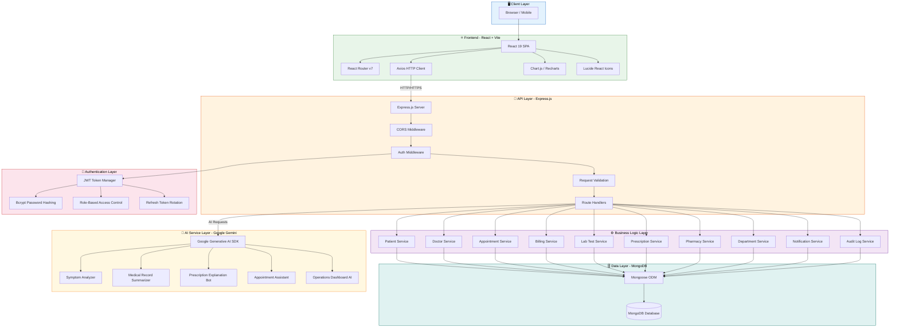

---

## Component Architecture

### Frontend Architecture

The frontend is a **React 19 Single-Page Application** built with **Vite** for blazing-fast HMR and optimized builds. It communicates with the backend exclusively through REST API calls via Axios.

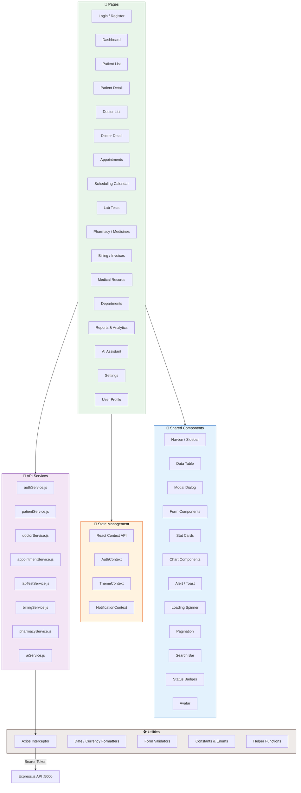

**Key Frontend Decisions:**

| Decision | Rationale |
|----------|-----------|
| **Vite** over CRA | 10-100x faster HMR, native ESM support, optimized builds |
| **React Router v7** | File-system-like routing, nested layouts, data loaders |
| **Axios** over Fetch | Interceptors for JWT refresh, request/response transforms, cancellation |
| **Context API** over Redux | Sufficient for auth/theme state; avoids Redux boilerplate for this scale |
| **Chart.js** | Lightweight, responsive charts for dashboards and analytics |
| **Lucide React** | Tree-shakeable, consistent icon set with medical/healthcare icons |

### Backend Architecture

The backend follows a **layered architecture** pattern with clear separation between routes, controllers, services, and models.

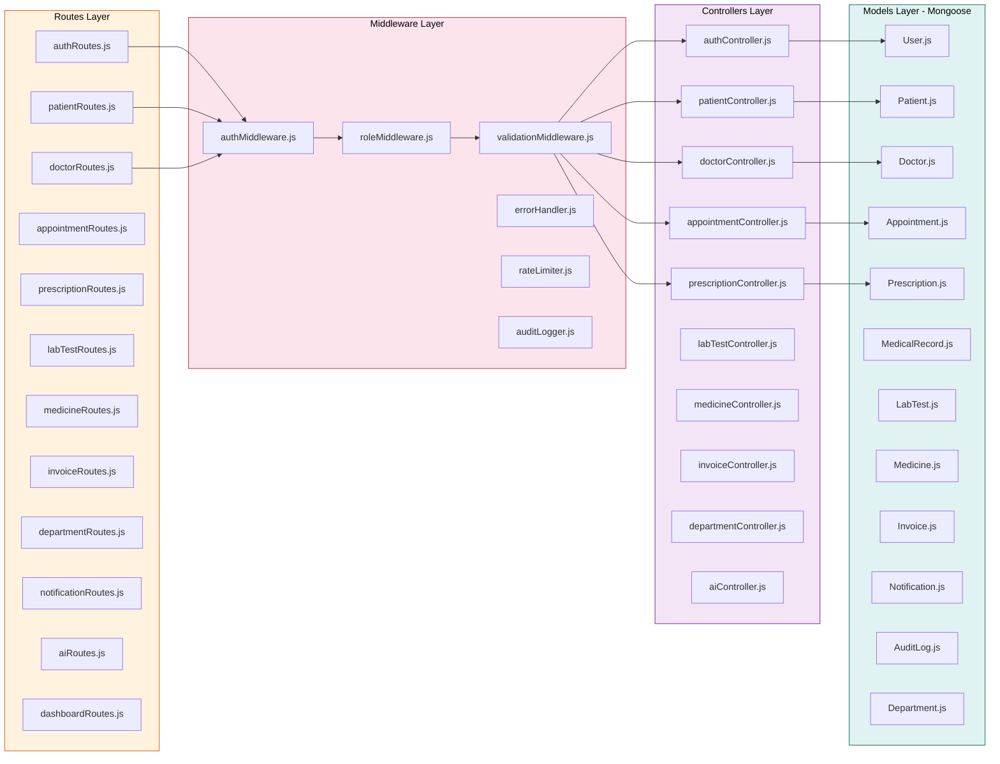

**Request Processing Pipeline:**

```
Client Request
    │
    ▼
┌─────────────────────┐
│  Express.js Server   │
│  (CORS, Body Parser) │
└──────────┬──────────┘
           │
           ▼
┌─────────────────────┐
│  Auth Middleware      │  ← Verify JWT, extract user
│  (JWT Verification)   │
└──────────┬──────────┘
           │
           ▼
┌─────────────────────┐
│  Role Middleware      │  ← Check user has required role
│  (RBAC Check)         │
└──────────┬──────────┘
           │
           ▼
┌─────────────────────┐
│  Validation Layer     │  ← Validate request body/params
└──────────┬──────────┘
           │
           ▼
┌─────────────────────┐
│  Route Handler /      │  ← Business logic execution
│  Controller           │
└──────────┬──────────┘
           │
           ▼
┌─────────────────────┐
│  Mongoose Model       │  ← Database operations
│  (MongoDB)            │
└──────────┬──────────┘
           │
           ▼
┌─────────────────────┐
│  Audit Logger         │  ← Log action to AuditLogs
└──────────┬──────────┘
           │
           ▼
┌─────────────────────┐
│  Response             │  ← JSON response to client
│  (Success / Error)    │
└─────────────────────┘
```

### AI Service Layer

The AI service layer integrates **Google Gemini** (via the `@google/generative-ai` SDK) to provide five intelligent features.

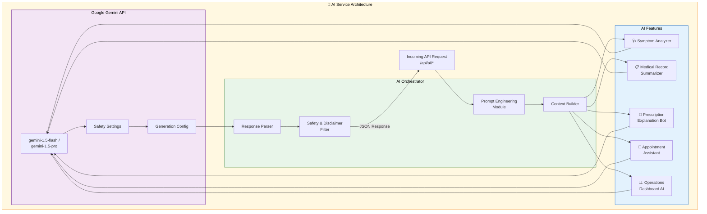

---

## Data Flow Diagrams

### 1. Patient Registration & Appointment Booking

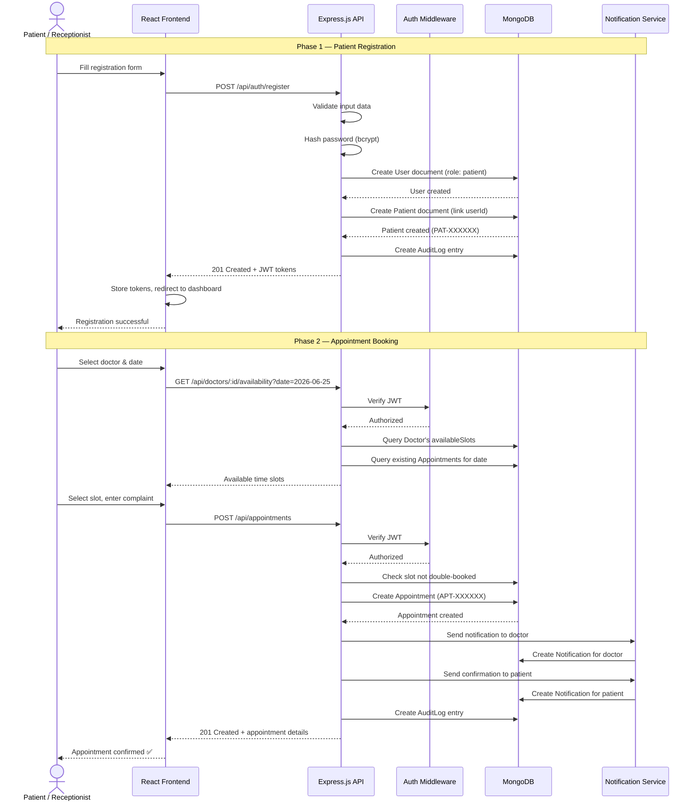

### 2. Lab Test Ordering & Results

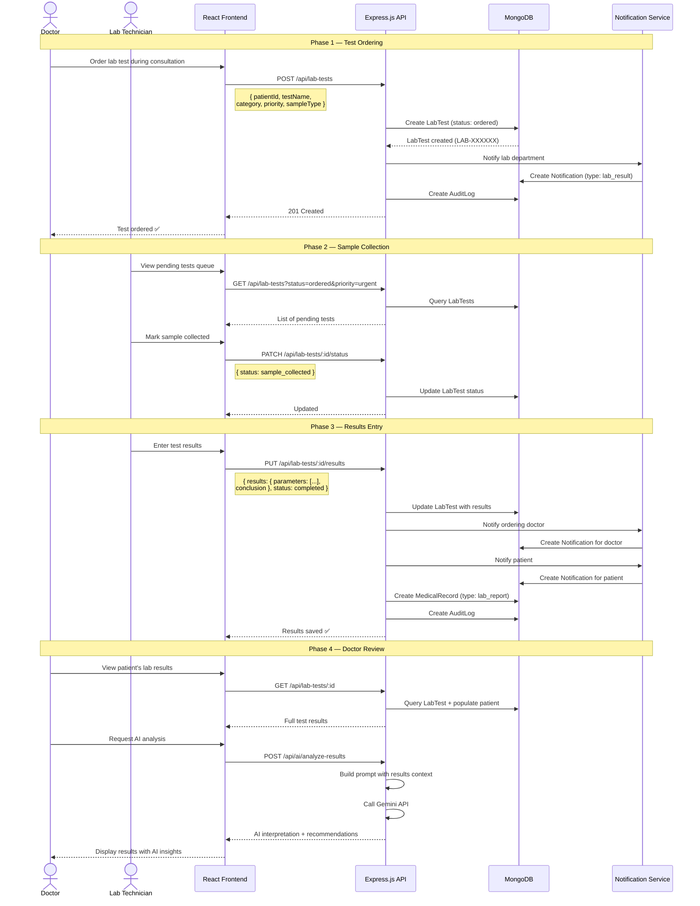

### 3. Billing Flow

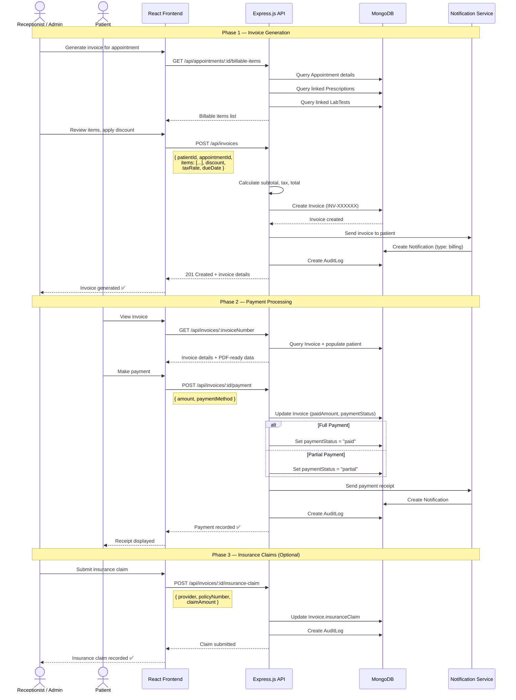

### 4. Emergency Case Handling

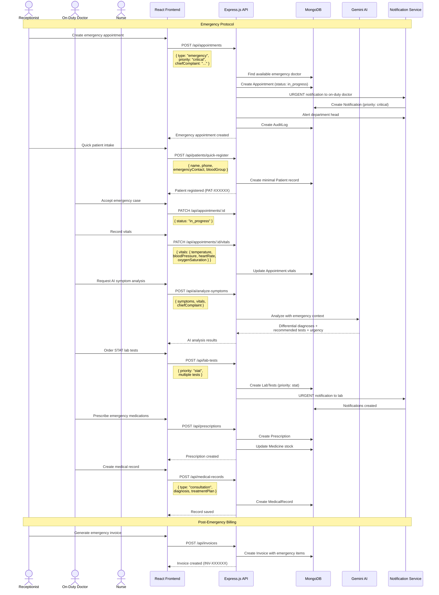

---

## Security Architecture

### JWT Authentication Flow

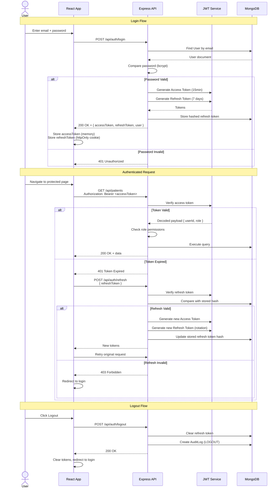

**Token Specifications:**

| Token | Algorithm | Expiry | Storage | Purpose |
|-------|-----------|--------|---------|---------|
| Access Token | HS256 | 15 minutes | Memory (JS variable) | API authorization |
| Refresh Token | HS256 | 7 days | HttpOnly cookie / secure storage | Token renewal |

> [!CAUTION]
> Access tokens are stored in JavaScript memory (not localStorage) to prevent XSS attacks. Refresh tokens use HttpOnly cookies to prevent JavaScript access.

### Role-Based Access Control (RBAC)

The system implements **6 user roles** with granular permissions across all resources:

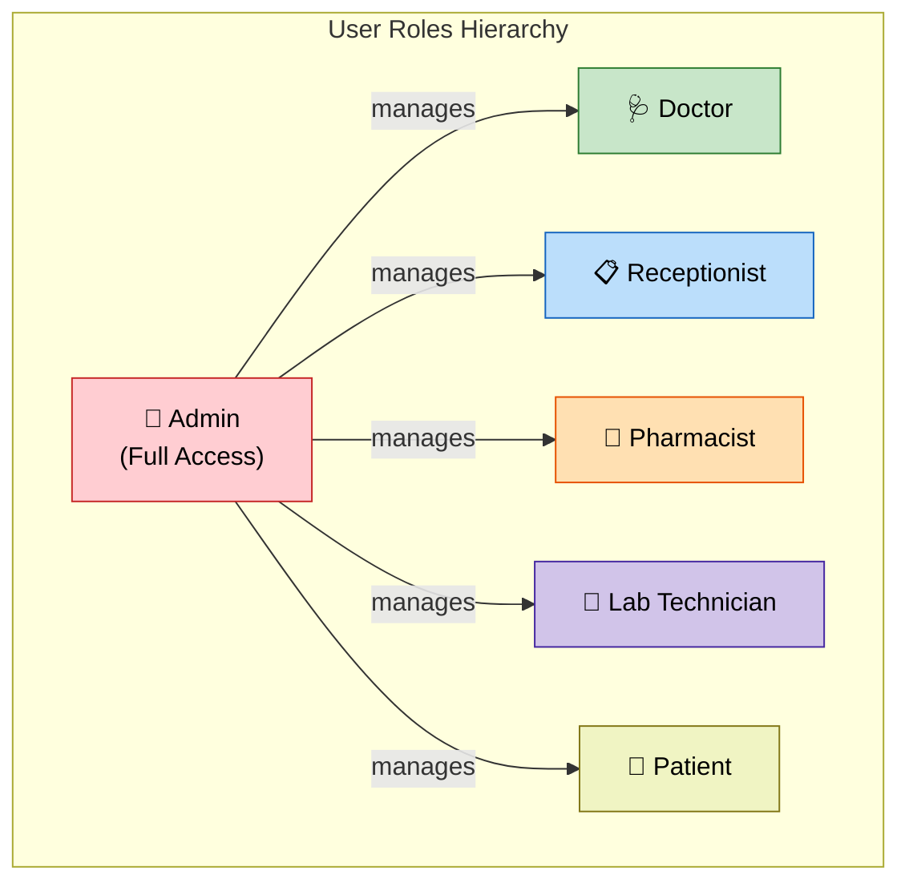

#### Permissions Matrix

| Resource | Admin | Doctor | Receptionist | Patient | Pharmacist | Lab Tech |
|----------|:-----:|:------:|:------------:|:-------:|:----------:|:--------:|
| **Users** | CRUD | R (self) | R | R (self) | R (self) | R (self) |
| **Patients** | CRUD | R/U | CRU | R (own) | R | R |
| **Doctors** | CRUD | R/U (self) | R | R | R | R |
| **Departments** | CRUD | R | R | R | R | R |
| **Appointments** | CRUD | RU (own) | CRUD | CRU (own) | — | — |
| **Prescriptions** | CRUD | CRUD (own) | R | R (own) | R | — |
| **Medical Records** | CRUD | CRUD (own) | R | R (own) | — | R |
| **Lab Tests** | CRUD | CRU | R | R (own) | — | RU |
| **Medicines** | CRUD | R | R | — | CRUD | — |
| **Invoices** | CRUD | R | CRUD | R (own) | — | — |
| **Notifications** | CRUD | RU (own) | RU (own) | RU (own) | RU (own) | RU (own) |
| **Audit Logs** | R | — | — | — | — | — |
| **AI Features** | ✅ All | ✅ All | ✅ Appt AI | ✅ Symptom, Rx | — | — |
| **Dashboard** | Full | Doctor | Reception | Patient | Pharmacy | Lab |

*Legend: C = Create, R = Read, U = Update, D = Delete, — = No Access*

**Middleware Implementation:**

```javascript
// Role-based access middleware pattern
const authorize = (...allowedRoles) => {
  return (req, res, next) => {
    if (!req.user) {
      return res.status(401).json({ message: 'Not authenticated' });
    }
    if (!allowedRoles.includes(req.user.role)) {
      return res.status(403).json({ message: 'Insufficient permissions' });
    }
    next();
  };
};

// Usage in routes
router.get('/patients', auth, authorize('admin', 'doctor', 'receptionist'), getPatients);
router.delete('/patients/:id', auth, authorize('admin'), deletePatient);
```

> [!IMPORTANT]
> Resource-level access control (e.g., "patient can only view their own records") is enforced in the controller/service layer by filtering queries with the authenticated user's ID.

---

## Deployment Architecture

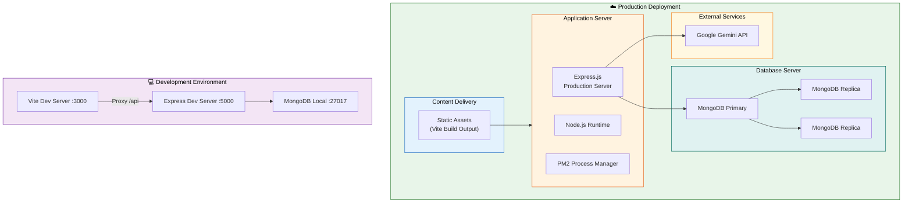

**Development vs. Production:**

| Aspect | Development | Production |
|--------|-------------|------------|
| **Frontend** | Vite dev server (`:3000`) with HMR | Static build served by Express or CDN |
| **Backend** | Nodemon with auto-restart | PM2 with cluster mode |
| **Database** | Local MongoDB (`:27017`) | MongoDB Atlas / Replica Set |
| **API Proxy** | Vite proxy (`/api` → `:5000`) | Same-origin or reverse proxy (Nginx) |
| **Environment** | `.env` file | Environment variables / secrets manager |
| **Logging** | Console output | Structured logging (Winston/Pino) |
| **CORS** | `http://localhost:3000` | Production domain |

---

## Technology Stack

| Layer | Technology | Version | Purpose |
|-------|-----------|---------|---------|
| **Frontend** | React | 19.1.0 | UI library |
| | Vite | 6.3.5 | Build tool & dev server |
| | React Router | 7.6.2 | Client-side routing |
| | Axios | 1.9.0 | HTTP client |
| | Chart.js | 4.5.0 | Data visualization |
| | react-chartjs-2 | 5.3.0 | React Chart.js wrapper |
| | Lucide React | 0.511.0 | Icon system |
| **Backend** | Node.js | 20+ LTS | Runtime |
| | Express.js | 4.21.0 | Web framework |
| | Mongoose | 8.7.0 | MongoDB ODM |
| | jsonwebtoken | 9.0.2 | JWT auth |
| | bcryptjs | 2.4.3 | Password hashing |
| | cors | 2.8.5 | CORS middleware |
| | dotenv | 16.4.5 | Environment variables |
| **AI** | @google/generative-ai | 0.21.0 | Gemini AI SDK |
| **Database** | MongoDB | 7.0+ | Document database |
| **Dev Tools** | Nodemon | 3.1.7 | Auto-restart server |
| | @vitejs/plugin-react | 4.5.2 | React support for Vite |

---

> [!NOTE]
> This architecture is designed for a **single-hospital deployment**. For multi-hospital / multi-tenant deployment, the architecture would need tenant isolation at the database level (separate databases per tenant or tenant-scoped queries) and a gateway service for tenant routing.
