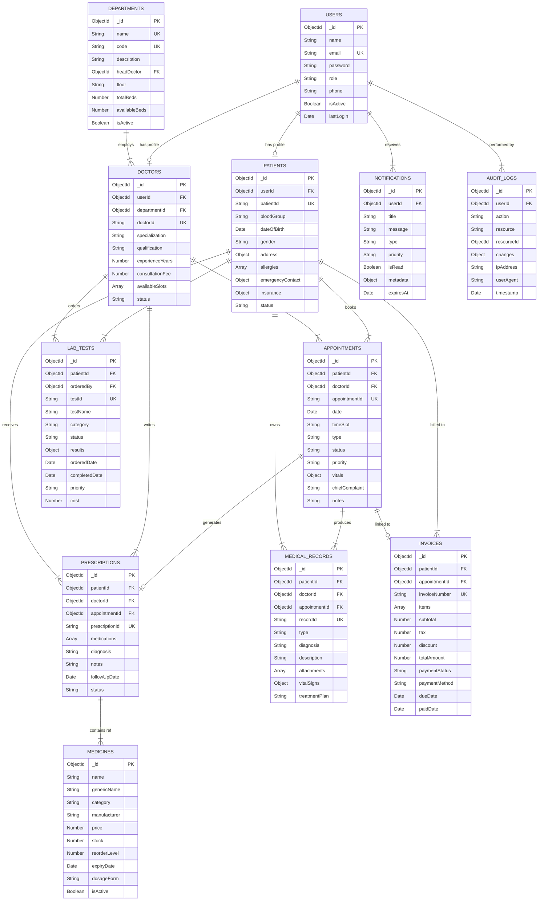

# 🗄️ Database Design Document

**Project:** MedCare HMS — AI-Powered Hospital Management System
**Database:** MongoDB (via Mongoose ODM)
**Version:** 1.0.0
**Last Updated:** 2026-06-24

---

## Table of Contents

- [Overview](#overview)
- [Entity-Relationship Diagram](#entity-relationship-diagram)
- [Collections](#collections)
  - [1. Users](#1-users)
  - [2. Patients](#2-patients)
  - [3. Doctors](#3-doctors)
  - [4. Departments](#4-departments)
  - [5. Appointments](#5-appointments)
  - [6. Prescriptions](#6-prescriptions)
  - [7. Medical Records](#7-medical-records)
  - [8. Lab Tests](#8-lab-tests)
  - [9. Medicines](#9-medicines)
  - [10. Invoices](#10-invoices)
  - [11. Notifications](#11-notifications)
  - [12. Audit Logs](#12-audit-logs)
- [Indexes Strategy](#indexes-strategy)
- [Design Decisions](#design-decisions)

---

## Overview

MedCare HMS uses **MongoDB** as its primary data store, accessed through the **Mongoose ODM** (v8.7+). The database is named `hospital_management` and consists of **12 collections** that model the entire hospital workflow — from patient registration and doctor scheduling to lab testing, billing, and AI-powered analytics.

The schema design balances **document-level denormalization** for read performance with **referential integrity** via ObjectId references where data consistency is critical.

> [!NOTE]
> MongoDB was chosen for its schema flexibility, natural fit with JSON-based REST APIs, and ease of embedding sub-documents for healthcare data that varies widely across patients and specializations.

---

## Entity-Relationship Diagram

---

## Collections

### 1. Users

The **Users** collection serves as the central authentication and identity store. Every person who interacts with the system (admins, doctors, receptionists, patients, pharmacists, lab technicians) has a User document.

#### Schema Fields

| Field | Type | Required | Default | Description |
|-------|------|----------|---------|-------------|
| `_id` | `ObjectId` | Auto | Auto-generated | Primary key |
| `name` | `String` | ✅ | — | Full name of the user |
| `email` | `String` | ✅ | — | Unique email address, used for login |
| `password` | `String` | ✅ | — | Bcrypt-hashed password (min 8 chars) |
| `role` | `String` | ✅ | `"patient"` | Enum: `admin`, `doctor`, `receptionist`, `patient`, `pharmacist`, `lab_technician` |
| `phone` | `String` | ✅ | — | Contact phone number |
| `avatar` | `String` | ❌ | `null` | URL to profile image |
| `isActive` | `Boolean` | ❌ | `true` | Soft-delete / account status flag |
| `isEmailVerified` | `Boolean` | ❌ | `false` | Email verification status |
| `lastLogin` | `Date` | ❌ | `null` | Timestamp of most recent login |
| `refreshToken` | `String` | ❌ | `null` | Hashed JWT refresh token |
| `createdAt` | `Date` | Auto | `Date.now` | Mongoose timestamp |
| `updatedAt` | `Date` | Auto | `Date.now` | Mongoose timestamp |

#### Indexes

| Index | Fields | Type | Purpose |
|-------|--------|------|---------|
| Email Unique | `{ email: 1 }` | Unique | Fast login lookup, prevent duplicates |
| Role | `{ role: 1 }` | Regular | Filter users by role |
| Active + Role | `{ isActive: 1, role: 1 }` | Compound | Dashboard queries for active staff |

#### Relationships

- **1:1** with `Patients` — if `role === "patient"`
- **1:1** with `Doctors` — if `role === "doctor"`
- **1:N** with `Notifications` — receives system notifications
- **1:N** with `AuditLogs` — actions performed by this user

> [!IMPORTANT]
> Passwords are hashed using **bcryptjs** with a salt round of 12 before storage. Raw passwords are never persisted.

---

### 2. Patients

The **Patients** collection stores clinical and demographic data specific to patients. It extends the base `Users` document with healthcare-specific fields.

#### Schema Fields

| Field | Type | Required | Default | Description |
|-------|------|----------|---------|-------------|
| `_id` | `ObjectId` | Auto | Auto-generated | Primary key |
| `userId` | `ObjectId` | ✅ | — | Reference to `Users._id` |
| `patientId` | `String` | Auto | Auto (`PAT-XXXXXX`) | Human-readable unique patient ID |
| `dateOfBirth` | `Date` | ✅ | — | Patient's date of birth |
| `gender` | `String` | ✅ | — | Enum: `male`, `female`, `other` |
| `bloodGroup` | `String` | ❌ | — | Enum: `A+`, `A-`, `B+`, `B-`, `AB+`, `AB-`, `O+`, `O-` |
| `maritalStatus` | `String` | ❌ | — | Enum: `single`, `married`, `divorced`, `widowed` |
| `address` | `Object` | ❌ | `{}` | Embedded: `{ street, city, state, zipCode, country }` |
| `allergies` | `[String]` | ❌ | `[]` | Known allergies |
| `chronicConditions` | `[String]` | ❌ | `[]` | Ongoing conditions (e.g., diabetes, hypertension) |
| `emergencyContact` | `Object` | ✅ | — | Embedded: `{ name, relationship, phone }` |
| `insurance` | `Object` | ❌ | `{}` | Embedded: `{ provider, policyNumber, expiryDate, coverageType }` |
| `status` | `String` | ❌ | `"active"` | Enum: `active`, `admitted`, `discharged`, `deceased` |
| `admissionDate` | `Date` | ❌ | `null` | Current admission date (if admitted) |
| `dischargeDate` | `Date` | ❌ | `null` | Most recent discharge date |
| `createdAt` | `Date` | Auto | `Date.now` | Mongoose timestamp |
| `updatedAt` | `Date` | Auto | `Date.now` | Mongoose timestamp |

#### Indexes

| Index | Fields | Type | Purpose |
|-------|--------|------|---------|
| Patient ID | `{ patientId: 1 }` | Unique | Human-readable ID lookup |
| User Ref | `{ userId: 1 }` | Unique | One patient per user |
| Blood Group | `{ bloodGroup: 1 }` | Regular | Emergency blood bank queries |
| Status | `{ status: 1 }` | Regular | Filter admitted/active patients |

#### Relationships

- **N:1** with `Users` — extends user profile
- **1:N** with `Appointments` — patient's appointment history
- **1:N** with `MedicalRecords` — patient's medical history
- **1:N** with `Prescriptions` — patient's prescription history
- **1:N** with `LabTests` — lab tests ordered for this patient
- **1:N** with `Invoices` — billing history

---

### 3. Doctors

The **Doctors** collection stores professional and scheduling information for medical practitioners.

#### Schema Fields

| Field | Type | Required | Default | Description |
|-------|------|----------|---------|-------------|
| `_id` | `ObjectId` | Auto | Auto-generated | Primary key |
| `userId` | `ObjectId` | ✅ | — | Reference to `Users._id` |
| `departmentId` | `ObjectId` | ✅ | — | Reference to `Departments._id` |
| `doctorId` | `String` | Auto | Auto (`DOC-XXXXXX`) | Human-readable unique doctor ID |
| `specialization` | `String` | ✅ | — | Medical specialization (e.g., Cardiology) |
| `qualification` | `String` | ✅ | — | Degrees (e.g., MBBS, MD, DM) |
| `experienceYears` | `Number` | ✅ | — | Years of professional experience |
| `licenseNumber` | `String` | ✅ | — | Medical license / registration number |
| `consultationFee` | `Number` | ✅ | — | Fee per consultation (in INR/USD) |
| `availableSlots` | `[Object]` | ❌ | `[]` | Array of `{ day, startTime, endTime }` objects |
| `maxPatientsPerSlot` | `Number` | ❌ | `10` | Maximum appointments per time slot |
| `bio` | `String` | ❌ | — | Short professional biography |
| `status` | `String` | ❌ | `"active"` | Enum: `active`, `on_leave`, `inactive` |
| `rating` | `Number` | ❌ | `0` | Average patient rating (0-5) |
| `totalReviews` | `Number` | ❌ | `0` | Count of patient reviews |
| `createdAt` | `Date` | Auto | `Date.now` | Mongoose timestamp |
| `updatedAt` | `Date` | Auto | `Date.now` | Mongoose timestamp |

#### Indexes

| Index | Fields | Type | Purpose |
|-------|--------|------|---------|
| Doctor ID | `{ doctorId: 1 }` | Unique | Human-readable ID lookup |
| User Ref | `{ userId: 1 }` | Unique | One doctor per user |
| Department | `{ departmentId: 1 }` | Regular | List doctors by department |
| Specialization | `{ specialization: 1 }` | Regular | Search by specialization |
| Status | `{ status: 1 }` | Regular | Filter active doctors |

#### Relationships

- **N:1** with `Users` — extends user profile
- **N:1** with `Departments` — belongs to a department
- **1:N** with `Appointments` — doctor's schedule
- **1:N** with `Prescriptions` — prescriptions authored
- **1:N** with `MedicalRecords` — records authored
- **1:N** with `LabTests` — tests ordered

---

### 4. Departments

The **Departments** collection models hospital organizational units (e.g., Cardiology, Neurology, Emergency).

#### Schema Fields

| Field | Type | Required | Default | Description |
|-------|------|----------|---------|-------------|
| `_id` | `ObjectId` | Auto | Auto-generated | Primary key |
| `name` | `String` | ✅ | — | Department name (e.g., "Cardiology") |
| `code` | `String` | ✅ | — | Short code (e.g., "CARD") |
| `description` | `String` | ❌ | — | Department description |
| `headDoctor` | `ObjectId` | ❌ | `null` | Reference to `Doctors._id` (HOD) |
| `floor` | `String` | ❌ | — | Physical location / floor |
| `building` | `String` | ❌ | — | Building name or wing |
| `phone` | `String` | ❌ | — | Department contact number |
| `email` | `String` | ❌ | — | Department email |
| `totalBeds` | `Number` | ❌ | `0` | Total bed capacity |
| `availableBeds` | `Number` | ❌ | `0` | Currently available beds |
| `operatingHours` | `Object` | ❌ | — | `{ open, close }` times |
| `isActive` | `Boolean` | ❌ | `true` | Department active status |
| `createdAt` | `Date` | Auto | `Date.now` | Mongoose timestamp |
| `updatedAt` | `Date` | Auto | `Date.now` | Mongoose timestamp |

#### Indexes

| Index | Fields | Type | Purpose |
|-------|--------|------|---------|
| Name | `{ name: 1 }` | Unique | Prevent duplicate departments |
| Code | `{ code: 1 }` | Unique | Quick lookup by code |
| Active | `{ isActive: 1 }` | Regular | Filter active departments |

#### Relationships

- **1:N** with `Doctors` — doctors in this department
- **1:1** (optional) with `Doctors` — head of department

---

### 5. Appointments

The **Appointments** collection is the core scheduling entity, connecting patients with doctors at specific time slots.

#### Schema Fields

| Field | Type | Required | Default | Description |
|-------|------|----------|---------|-------------|
| `_id` | `ObjectId` | Auto | Auto-generated | Primary key |
| `patientId` | `ObjectId` | ✅ | — | Reference to `Patients._id` |
| `doctorId` | `ObjectId` | ✅ | — | Reference to `Doctors._id` |
| `appointmentId` | `String` | Auto | Auto (`APT-XXXXXX`) | Human-readable appointment ID |
| `date` | `Date` | ✅ | — | Appointment date |
| `timeSlot` | `String` | ✅ | — | Time slot (e.g., "09:00-09:30") |
| `type` | `String` | ✅ | `"consultation"` | Enum: `consultation`, `follow_up`, `emergency`, `routine_checkup`, `surgery` |
| `status` | `String` | ❌ | `"scheduled"` | Enum: `scheduled`, `confirmed`, `in_progress`, `completed`, `cancelled`, `no_show` |
| `priority` | `String` | ❌ | `"normal"` | Enum: `low`, `normal`, `high`, `critical` |
| `chiefComplaint` | `String` | ❌ | — | Patient's primary complaint |
| `symptoms` | `[String]` | ❌ | `[]` | Reported symptoms |
| `vitals` | `Object` | ❌ | `{}` | Embedded: `{ temperature, bloodPressure, heartRate, weight, height, oxygenSaturation }` |
| `notes` | `String` | ❌ | — | Doctor's notes during/after consultation |
| `aiSummary` | `String` | ❌ | — | AI-generated consultation summary |
| `cancelReason` | `String` | ❌ | — | Reason for cancellation (if cancelled) |
| `createdAt` | `Date` | Auto | `Date.now` | Mongoose timestamp |
| `updatedAt` | `Date` | Auto | `Date.now` | Mongoose timestamp |

#### Indexes

| Index | Fields | Type | Purpose |
|-------|--------|------|---------|
| Appointment ID | `{ appointmentId: 1 }` | Unique | Human-readable lookup |
| Patient | `{ patientId: 1 }` | Regular | Patient's appointment list |
| Doctor + Date | `{ doctorId: 1, date: 1 }` | Compound | Doctor's daily schedule |
| Status | `{ status: 1 }` | Regular | Filter by status |
| Date | `{ date: -1 }` | Regular | Chronological ordering |
| Priority | `{ priority: 1 }` | Regular | Emergency queue |

#### Relationships

- **N:1** with `Patients` — appointment belongs to a patient
- **N:1** with `Doctors` — appointment assigned to a doctor
- **1:1** (optional) with `Prescriptions` — prescription from this visit
- **1:N** with `MedicalRecords` — records generated during visit
- **1:1** (optional) with `Invoices` — billing for this visit

---

### 6. Prescriptions

The **Prescriptions** collection stores medication orders written by doctors for patients.

#### Schema Fields

| Field | Type | Required | Default | Description |
|-------|------|----------|---------|-------------|
| `_id` | `ObjectId` | Auto | Auto-generated | Primary key |
| `patientId` | `ObjectId` | ✅ | — | Reference to `Patients._id` |
| `doctorId` | `ObjectId` | ✅ | — | Reference to `Doctors._id` |
| `appointmentId` | `ObjectId` | ❌ | `null` | Reference to `Appointments._id` |
| `prescriptionId` | `String` | Auto | Auto (`RX-XXXXXX`) | Human-readable prescription ID |
| `diagnosis` | `String` | ✅ | — | Primary diagnosis / ICD code |
| `diagnosisNotes` | `String` | ❌ | — | Detailed diagnosis description |
| `medications` | `[Object]` | ✅ | — | Array of medication sub-documents (see below) |
| `additionalInstructions` | `String` | ❌ | — | General instructions for the patient |
| `followUpDate` | `Date` | ❌ | `null` | Recommended follow-up date |
| `status` | `String` | ❌ | `"active"` | Enum: `active`, `completed`, `cancelled`, `expired` |
| `aiExplanation` | `String` | ❌ | — | AI-generated plain-language explanation |
| `createdAt` | `Date` | Auto | `Date.now` | Mongoose timestamp |
| `updatedAt` | `Date` | Auto | `Date.now` | Mongoose timestamp |

**Medications Sub-document:**

| Field | Type | Required | Description |
|-------|------|----------|-------------|
| `medicineId` | `ObjectId` | ❌ | Reference to `Medicines._id` |
| `name` | `String` | ✅ | Medicine name (denormalized) |
| `dosage` | `String` | ✅ | Dosage (e.g., "500mg") |
| `frequency` | `String` | ✅ | Frequency (e.g., "Twice daily") |
| `duration` | `String` | ✅ | Duration (e.g., "7 days") |
| `route` | `String` | ❌ | Route (e.g., "Oral", "IV") |
| `instructions` | `String` | ❌ | Special instructions (e.g., "Take after meals") |

#### Indexes

| Index | Fields | Type | Purpose |
|-------|--------|------|---------|
| Prescription ID | `{ prescriptionId: 1 }` | Unique | Human-readable lookup |
| Patient | `{ patientId: 1 }` | Regular | Patient's prescription history |
| Doctor | `{ doctorId: 1 }` | Regular | Doctor's prescription list |
| Appointment | `{ appointmentId: 1 }` | Regular | Link to appointment |
| Status | `{ status: 1 }` | Regular | Active prescriptions query |

#### Relationships

- **N:1** with `Patients` — prescribed to
- **N:1** with `Doctors` — prescribed by
- **N:1** (optional) with `Appointments` — linked visit
- **N:N** (via embedded refs) with `Medicines` — medications referenced

> [!TIP]
> Medicine names are **denormalized** into the medications array to avoid a JOIN on every prescription read. The `medicineId` reference is kept for inventory management.

---

### 7. Medical Records

The **Medical Records** collection is the patient's clinical history — diagnoses, treatments, vitals, and attachments.

#### Schema Fields

| Field | Type | Required | Default | Description |
|-------|------|----------|---------|-------------|
| `_id` | `ObjectId` | Auto | Auto-generated | Primary key |
| `patientId` | `ObjectId` | ✅ | — | Reference to `Patients._id` |
| `doctorId` | `ObjectId` | ✅ | — | Reference to `Doctors._id` (author) |
| `appointmentId` | `ObjectId` | ❌ | `null` | Reference to `Appointments._id` |
| `recordId` | `String` | Auto | Auto (`MR-XXXXXX`) | Human-readable record ID |
| `type` | `String` | ✅ | — | Enum: `consultation`, `lab_report`, `imaging`, `surgery`, `discharge_summary`, `progress_note` |
| `title` | `String` | ✅ | — | Record title/summary |
| `diagnosis` | `String` | ❌ | — | Diagnosis (ICD-10 code or text) |
| `description` | `String` | ✅ | — | Detailed clinical notes |
| `vitalSigns` | `Object` | ❌ | `{}` | Embedded vitals at time of recording |
| `treatmentPlan` | `String` | ❌ | — | Proposed treatment plan |
| `attachments` | `[Object]` | ❌ | `[]` | Array of `{ fileName, fileUrl, fileType, uploadDate }` |
| `tags` | `[String]` | ❌ | `[]` | Searchable tags (e.g., "cardiac", "post-op") |
| `isConfidential` | `Boolean` | ❌ | `false` | Restricts access to treating doctor only |
| `aiSummary` | `String` | ❌ | — | AI-generated record summary |
| `createdAt` | `Date` | Auto | `Date.now` | Mongoose timestamp |
| `updatedAt` | `Date` | Auto | `Date.now` | Mongoose timestamp |

#### Indexes

| Index | Fields | Type | Purpose |
|-------|--------|------|---------|
| Record ID | `{ recordId: 1 }` | Unique | Human-readable lookup |
| Patient | `{ patientId: 1 }` | Regular | Patient history |
| Patient + Type | `{ patientId: 1, type: 1 }` | Compound | Filter records by type |
| Doctor | `{ doctorId: 1 }` | Regular | Records authored by doctor |
| Date | `{ createdAt: -1 }` | Regular | Chronological ordering |
| Tags | `{ tags: 1 }` | Multikey | Tag-based search |

#### Relationships

- **N:1** with `Patients` — record belongs to patient
- **N:1** with `Doctors` — record authored by doctor
- **N:1** (optional) with `Appointments` — linked appointment

---

### 8. Lab Tests

The **Lab Tests** collection tracks diagnostic test orders, statuses, and results.

#### Schema Fields

| Field | Type | Required | Default | Description |
|-------|------|----------|---------|-------------|
| `_id` | `ObjectId` | Auto | Auto-generated | Primary key |
| `patientId` | `ObjectId` | ✅ | — | Reference to `Patients._id` |
| `orderedBy` | `ObjectId` | ✅ | — | Reference to `Doctors._id` |
| `processedBy` | `ObjectId` | ❌ | `null` | Reference to `Users._id` (lab tech) |
| `testId` | `String` | Auto | Auto (`LAB-XXXXXX`) | Human-readable test ID |
| `testName` | `String` | ✅ | — | Name of the test (e.g., "CBC", "Lipid Panel") |
| `testCode` | `String` | ❌ | — | Standard test code |
| `category` | `String` | ✅ | — | Enum: `hematology`, `biochemistry`, `microbiology`, `pathology`, `radiology`, `immunology` |
| `status` | `String` | ❌ | `"ordered"` | Enum: `ordered`, `sample_collected`, `processing`, `completed`, `cancelled` |
| `priority` | `String` | ❌ | `"normal"` | Enum: `normal`, `urgent`, `stat` |
| `sampleType` | `String` | ❌ | — | Sample type (e.g., "Blood", "Urine") |
| `results` | `Object` | ❌ | `null` | Embedded: `{ parameters: [{ name, value, unit, referenceRange, isAbnormal }], conclusion, notes }` |
| `orderedDate` | `Date` | Auto | `Date.now` | When the test was ordered |
| `sampleCollectedDate` | `Date` | ❌ | `null` | When the sample was collected |
| `completedDate` | `Date` | ❌ | `null` | When results were finalized |
| `cost` | `Number` | ✅ | — | Test cost |
| `notes` | `String` | ❌ | — | Additional notes / observations |
| `attachments` | `[Object]` | ❌ | `[]` | Report file attachments |
| `createdAt` | `Date` | Auto | `Date.now` | Mongoose timestamp |
| `updatedAt` | `Date` | Auto | `Date.now` | Mongoose timestamp |

#### Indexes

| Index | Fields | Type | Purpose |
|-------|--------|------|---------|
| Test ID | `{ testId: 1 }` | Unique | Human-readable lookup |
| Patient | `{ patientId: 1 }` | Regular | Patient's test history |
| Status | `{ status: 1 }` | Regular | Pending tests queue |
| Priority + Status | `{ priority: 1, status: 1 }` | Compound | Urgent pending tests |
| Ordered Date | `{ orderedDate: -1 }` | Regular | Chronological ordering |
| Category | `{ category: 1 }` | Regular | Department-specific views |

#### Relationships

- **N:1** with `Patients` — test for this patient
- **N:1** with `Doctors` — ordered by this doctor
- **N:1** (optional) with `Users` — processed by lab technician

---

### 9. Medicines

The **Medicines** collection is the pharmacy inventory catalog.

#### Schema Fields

| Field | Type | Required | Default | Description |
|-------|------|----------|---------|-------------|
| `_id` | `ObjectId` | Auto | Auto-generated | Primary key |
| `name` | `String` | ✅ | — | Brand name |
| `genericName` | `String` | ✅ | — | Generic / chemical name |
| `category` | `String` | ✅ | — | Enum: `antibiotic`, `analgesic`, `antiviral`, `cardiovascular`, `neurological`, `dermatological`, `gastrointestinal`, `respiratory`, `supplement`, `other` |
| `manufacturer` | `String` | ✅ | — | Manufacturing company |
| `batchNumber` | `String` | ❌ | — | Current batch number |
| `dosageForm` | `String` | ✅ | — | Enum: `tablet`, `capsule`, `syrup`, `injection`, `cream`, `drops`, `inhaler`, `powder` |
| `strength` | `String` | ✅ | — | Strength (e.g., "500mg", "10ml") |
| `price` | `Number` | ✅ | — | Price per unit |
| `stock` | `Number` | ✅ | `0` | Current stock quantity |
| `reorderLevel` | `Number` | ❌ | `50` | Minimum stock before reorder alert |
| `expiryDate` | `Date` | ✅ | — | Expiry date |
| `sideEffects` | `[String]` | ❌ | `[]` | Known side effects |
| `contraindications` | `[String]` | ❌ | `[]` | Contraindications |
| `storageConditions` | `String` | ❌ | — | Storage requirements |
| `isActive` | `Boolean` | ❌ | `true` | Whether medicine is currently stocked |
| `isPrescriptionRequired` | `Boolean` | ❌ | `true` | OTC vs. prescription-only |
| `createdAt` | `Date` | Auto | `Date.now` | Mongoose timestamp |
| `updatedAt` | `Date` | Auto | `Date.now` | Mongoose timestamp |

#### Indexes

| Index | Fields | Type | Purpose |
|-------|--------|------|---------|
| Name + Strength | `{ name: 1, strength: 1 }` | Unique | Prevent duplicate entries |
| Generic Name | `{ genericName: 1 }` | Regular | Search by generic name |
| Category | `{ category: 1 }` | Regular | Category-based filtering |
| Stock Alert | `{ stock: 1, reorderLevel: 1 }` | Compound | Low-stock alerts |
| Expiry | `{ expiryDate: 1 }` | Regular | Expiry tracking |
| Active | `{ isActive: 1 }` | Regular | Active inventory only |

#### Relationships

- Referenced by `Prescriptions.medications[].medicineId` — medicines in prescriptions

---

### 10. Invoices

The **Invoices** collection manages billing, payments, and financial transactions.

#### Schema Fields

| Field | Type | Required | Default | Description |
|-------|------|----------|---------|-------------|
| `_id` | `ObjectId` | Auto | Auto-generated | Primary key |
| `patientId` | `ObjectId` | ✅ | — | Reference to `Patients._id` |
| `appointmentId` | `ObjectId` | ❌ | `null` | Reference to `Appointments._id` |
| `invoiceNumber` | `String` | Auto | Auto (`INV-XXXXXX`) | Human-readable invoice number |
| `items` | `[Object]` | ✅ | — | Line items (see sub-document below) |
| `subtotal` | `Number` | ✅ | — | Sum before tax/discount |
| `tax` | `Number` | ❌ | `0` | Tax amount |
| `taxRate` | `Number` | ❌ | `0` | Tax percentage |
| `discount` | `Number` | ❌ | `0` | Discount amount |
| `discountReason` | `String` | ❌ | — | Reason for discount |
| `totalAmount` | `Number` | ✅ | — | Final payable amount |
| `paidAmount` | `Number` | ❌ | `0` | Amount paid so far |
| `balanceDue` | `Number` | ❌ | — | Remaining balance |
| `paymentStatus` | `String` | ❌ | `"pending"` | Enum: `pending`, `partial`, `paid`, `overdue`, `refunded`, `cancelled` |
| `paymentMethod` | `String` | ❌ | — | Enum: `cash`, `card`, `upi`, `insurance`, `bank_transfer` |
| `paymentDate` | `Date` | ❌ | `null` | Date of full payment |
| `dueDate` | `Date` | ✅ | — | Payment due date |
| `insuranceClaim` | `Object` | ❌ | `null` | Embedded: `{ provider, policyNumber, claimAmount, claimStatus }` |
| `notes` | `String` | ❌ | — | Additional billing notes |
| `generatedBy` | `ObjectId` | ❌ | — | Reference to `Users._id` (staff who created) |
| `createdAt` | `Date` | Auto | `Date.now` | Mongoose timestamp |
| `updatedAt` | `Date` | Auto | `Date.now` | Mongoose timestamp |

**Invoice Items Sub-document:**

| Field | Type | Required | Description |
|-------|------|----------|-------------|
| `description` | `String` | ✅ | Item description |
| `category` | `String` | ✅ | Enum: `consultation`, `lab_test`, `medicine`, `procedure`, `room_charge`, `other` |
| `quantity` | `Number` | ✅ | Quantity |
| `unitPrice` | `Number` | ✅ | Price per unit |
| `total` | `Number` | ✅ | `quantity × unitPrice` |
| `referenceId` | `ObjectId` | ❌ | Reference to source document |

#### Indexes

| Index | Fields | Type | Purpose |
|-------|--------|------|---------|
| Invoice Number | `{ invoiceNumber: 1 }` | Unique | Human-readable lookup |
| Patient | `{ patientId: 1 }` | Regular | Patient billing history |
| Payment Status | `{ paymentStatus: 1 }` | Regular | Filter unpaid invoices |
| Due Date | `{ dueDate: 1 }` | Regular | Overdue tracking |
| Date Range | `{ createdAt: -1 }` | Regular | Financial reporting |

#### Relationships

- **N:1** with `Patients` — billed to
- **N:1** (optional) with `Appointments` — related visit
- **N:1** (optional) with `Users` — generated by staff

---

### 11. Notifications

The **Notifications** collection powers the real-time notification system for all user roles.

#### Schema Fields

| Field | Type | Required | Default | Description |
|-------|------|----------|---------|-------------|
| `_id` | `ObjectId` | Auto | Auto-generated | Primary key |
| `userId` | `ObjectId` | ✅ | — | Reference to `Users._id` (recipient) |
| `title` | `String` | ✅ | — | Notification title |
| `message` | `String` | ✅ | — | Notification body |
| `type` | `String` | ✅ | — | Enum: `appointment`, `lab_result`, `prescription`, `billing`, `system`, `emergency`, `reminder` |
| `priority` | `String` | ❌ | `"normal"` | Enum: `low`, `normal`, `high`, `critical` |
| `isRead` | `Boolean` | ❌ | `false` | Read status |
| `readAt` | `Date` | ❌ | `null` | When notification was read |
| `actionUrl` | `String` | ❌ | — | Deep link to relevant page |
| `metadata` | `Object` | ❌ | `{}` | Additional context data |
| `expiresAt` | `Date` | ❌ | `null` | Auto-expire date (TTL) |
| `createdAt` | `Date` | Auto | `Date.now` | Mongoose timestamp |

#### Indexes

| Index | Fields | Type | Purpose |
|-------|--------|------|---------|
| User + Read | `{ userId: 1, isRead: 1 }` | Compound | Unread notifications query |
| User + Date | `{ userId: 1, createdAt: -1 }` | Compound | Notification feed |
| Expiry TTL | `{ expiresAt: 1 }` | TTL (`expireAfterSeconds: 0`) | Auto-delete expired notifications |
| Type | `{ type: 1 }` | Regular | Filter by notification type |

#### Relationships

- **N:1** with `Users` — notification belongs to a user

---

### 12. Audit Logs

The **Audit Logs** collection provides a tamper-evident trail of all system actions for compliance and security.

#### Schema Fields

| Field | Type | Required | Default | Description |
|-------|------|----------|---------|-------------|
| `_id` | `ObjectId` | Auto | Auto-generated | Primary key |
| `userId` | `ObjectId` | ✅ | — | Reference to `Users._id` (actor) |
| `userName` | `String` | ❌ | — | Denormalized actor name |
| `userRole` | `String` | ❌ | — | Denormalized actor role |
| `action` | `String` | ✅ | — | Enum: `CREATE`, `READ`, `UPDATE`, `DELETE`, `LOGIN`, `LOGOUT`, `EXPORT`, `AI_QUERY` |
| `resource` | `String` | ✅ | — | Resource type (e.g., `Patient`, `Appointment`, `LabTest`) |
| `resourceId` | `ObjectId` | ❌ | `null` | ID of the affected document |
| `description` | `String` | ❌ | — | Human-readable action description |
| `changes` | `Object` | ❌ | `null` | Embedded: `{ before, after }` — diff of changed fields |
| `ipAddress` | `String` | ❌ | — | Client IP address |
| `userAgent` | `String` | ❌ | — | Browser / client user agent |
| `endpoint` | `String` | ❌ | — | API endpoint hit (e.g., `POST /api/appointments`) |
| `statusCode` | `Number` | ❌ | — | HTTP response status code |
| `timestamp` | `Date` | Auto | `Date.now` | When the action occurred |

#### Indexes

| Index | Fields | Type | Purpose |
|-------|--------|------|---------|
| User | `{ userId: 1 }` | Regular | User activity history |
| Action | `{ action: 1 }` | Regular | Filter by action type |
| Resource | `{ resource: 1, resourceId: 1 }` | Compound | Resource change history |
| Timestamp | `{ timestamp: -1 }` | Regular | Chronological ordering |
| User + Timestamp | `{ userId: 1, timestamp: -1 }` | Compound | User timeline |

> [!WARNING]
> Audit logs should be treated as **append-only**. The application should never update or delete audit log entries. Consider using MongoDB's capped collections or external archival for long-term retention.

#### Relationships

- **N:1** with `Users` — action performed by

---

## Indexes Strategy

The indexing strategy follows these principles:

| Principle | Implementation |
|-----------|---------------|
| **Primary lookups** | Unique indexes on all human-readable IDs (`patientId`, `doctorId`, `appointmentId`, etc.) |
| **Foreign key queries** | Regular indexes on all `ObjectId` reference fields |
| **Compound indexes** | Used for common multi-field queries (e.g., `doctorId + date` for schedules) |
| **TTL indexes** | Used on `Notifications.expiresAt` for automatic cleanup |
| **Text indexes** | Considered for future full-text search on medical records and notes |
| **Multikey indexes** | Used on array fields like `tags` for efficient array element queries |

> [!TIP]
> Use `db.collection.getIndexes()` and `db.collection.aggregate([{$indexStats:{}}])` to monitor index usage and identify unused indexes in production.

---

## Design Decisions

### Why MongoDB?

| Consideration | Decision |
|---------------|----------|
| **Schema Flexibility** | Medical records, lab results, and vitals vary widely across specializations. MongoDB's flexible schema handles this without painful migrations. |
| **Document Model** | A patient's record naturally fits a document — vitals, medications, and notes as embedded sub-documents reduce JOINs. |
| **JSON-Native** | The Express.js + React stack works with JSON end-to-end. MongoDB stores BSON (binary JSON), eliminating ORM impedance mismatch. |
| **Horizontal Scaling** | MongoDB's sharding capabilities support future growth as the hospital system scales across locations. |
| **Developer Velocity** | Mongoose ODM provides schema validation, middleware hooks, and virtuals that accelerate development. |

### Why Denormalization?

Certain fields are intentionally **denormalized** (duplicated) for read performance:

| Denormalized Field | Location | Why |
|--------------------|----------|-----|
| Medicine `name` | `Prescriptions.medications[]` | Prescriptions are read far more often than medicines change names. Avoids a JOIN on every prescription display. |
| User `name`, `role` | `AuditLogs` | Audit logs must remain valid even if the user is later deleted or renamed. Historical accuracy > normalization. |
| Patient vitals | `Appointments.vitals` | Vitals at appointment time are a point-in-time snapshot. They should not change retroactively. |

### Why Separate Users + Patients/Doctors?

The **Users** collection handles authentication (email, password, role, tokens) while **Patients** and **Doctors** collections handle domain-specific data. This separation:

1. **Keeps auth lean** — Login queries only hit the Users collection
2. **Supports multiple roles** — A future doctor-patient scenario is possible
3. **Follows SRP** — Authentication concerns are separated from clinical data
4. **Enables role-specific indexing** — Patient search indexes don't bloat the auth collection

### Why Embedded Sub-documents?

| Embedded Data | Parent | Rationale |
|---------------|--------|-----------|
| `medications[]` | Prescriptions | A prescription's medication list is always read together with the prescription. It's a bounded array (typically 1-10 items). |
| `results.parameters[]` | LabTests | Lab results are always read with the test. Moving to a separate collection would add unnecessary complexity. |
| `items[]` | Invoices | Invoice line items are meaningless outside the invoice context. They are a bounded set. |
| `address`, `emergencyContact`, `insurance` | Patients | These are 1:1 nested objects that are always accessed with the patient. |
| `vitals`, `vitalSigns` | Appointments, MedicalRecords | Point-in-time snapshots that should not be in a shared collection. |

### Data Integrity Approach

| Strategy | Implementation |
|----------|---------------|
| **Mongoose Validation** | Required fields, enum constraints, min/max values enforced at the ODM layer |
| **Pre-save Hooks** | Password hashing, auto-ID generation, timestamp management |
| **Application-level Refs** | Referential integrity checked in service layer before writes |
| **Soft Deletes** | `isActive` flags used instead of hard deletes for Users, Doctors, Departments, Medicines |
| **Optimistic Concurrency** | Mongoose's `__v` version key prevents conflicting updates |

---

> [!NOTE]
> This document describes the **logical schema design**. The actual Mongoose model files implementing these schemas are located in `server/models/`. Each collection maps to a single model file (e.g., `User.js`, `Patient.js`, `Doctor.js`, etc.).
